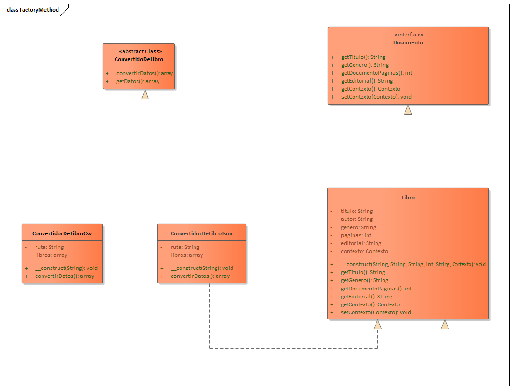
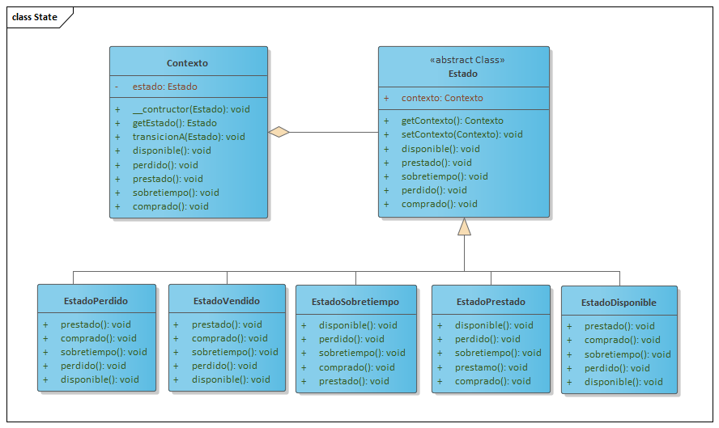
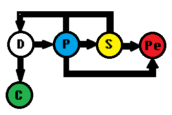
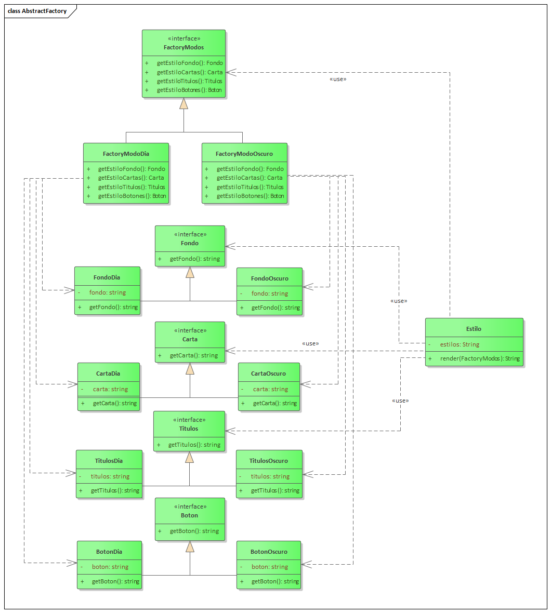
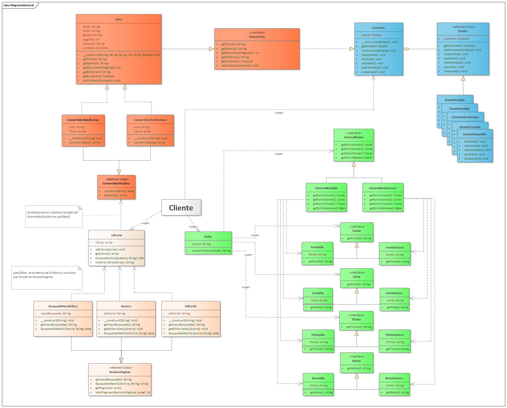

**Cloned and modified project of:** [LauraDevriendt/library-design-patterns](https://github.com/LauraDevriendt/library-design-patterns)

# **Libreria Pattern**

## **Description of the problem**

> It is required to develop a virtual library for clients where they store their data in JSON and CSV for easy management with other systems, the library consists of several books, these books have as data: Title, author, genre, pages and publisher, in addition a book can arrive To obtain different states, every book once created is available, both to be bought and to be loaned, if it is loaned, over time, the user can return it so that it is available again, he can request an extension of its provision time or say that it is lost, after the extended time elapses the user must return it or notify that he lost it, both in the state of purchase and lost, the books no longer return to any other state

>Additionally, the library consists of search engines such as: to search by Genre, to search by Title or search by Editorial and in addition to changing the subject for the day or night 

## **Patterns applied to the project**

### **Factory Method Pattern**

As already commented in the description of the problem, the data stored on the Documents (**Product**) are in both JSON and CSV formats, so we need a Data Converter (**Creator**) that implements common methods and inheritance in a Converter. JSON as a CSV Converter (**Concrete Creators**), in our library it only stores Books (**Concrete Product**) as Documents 

### **State Pattern**

Already explained in point 1. the books have states which will depend on where it goes to see its availability, this pattern is perfect for this problem, having five Specific States: Available State, Sold State, Borrowed State, Overtime State and Lost State, all of them inheriting from a State class and in turn this makes use of the Context to determine the behavior. 

The behavior between states would be:

### **Abstract Factory Pattern**

The application of this pattern helps to control by parts, the components that exist in the web application, such as the Background, The titles, The letters and The buttons (**Abstract Products**) to be able to customize the web view if the user wants a mode. Day or Night (**Concrete Factory**) each mode has its Concrete Classes of Abstract Products: Day Button, Dark Button, Day Titles, Dark Titles, ... (**Concrete Product**), Our client will use a Style class to take from an AbstractFactory and return a string that has CSS styles to change the properties of the components in the view 

## General Problem Diagram 

Use:

* PHP 7.4.14
* XAMPP

Finished: March - 2021